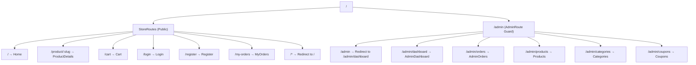

# 🌿 EcoStore — Complete Project Overview

---

## 📁 Project Structure

```
EcoStore/
├── backend/                    # Express.js API server (port 3000)
│   ├── config/                 # DB connection config
│   ├── controllers/            # Route handlers
│   ├── middleware/              # Auth & file upload middleware
│   ├── models/                 # Mongoose schemas
│   ├── routes/                 # API route definitions
│   ├── app.js                  # Express app setup (CORS, routes)
│   ├── index.js                # Server entry point
│   └── .env                    # Environment variables
│
└── frontend/                   # React + Vite (port 5173)
    └── src/
        ├── api/index.js        # Centralized API functions (axios)
        ├── components/         # Reusable UI components
        ├── pages/              # Page-level components
        ├── store/              # Zustand state management
        ├── App.jsx             # Root routing & layout
        ├── main.jsx            # React entry point
        └── index.css           # Global styles
```

---

## 🔧 Tech Stack

| Layer       | Technology                              |
|-------------|------------------------------------------|
| Frontend    | React 18, Vite, Tailwind CSS             |
| State       | Zustand (with persist middleware)         |
| Backend     | Express 5, Node.js (ES Modules)          |
| Database    | MongoDB Atlas (Mongoose)                 |
| Auth        | JWT (cookie-based, httpOnly)             |
| Payments    | Razorpay                                 |
| File Upload | Multer + Cloudinary                      |
| Notifications | react-hot-toast                        |
| Icons       | Lucide React                             |

---

## 🗄️ Database Models

### 1. User (`userModel.js`)
| Field      | Type   | Constraints                                      |
|------------|--------|---------------------------------------------------|
| `name`     | String | required, trimmed, lowercase                      |
| `email`    | String | required, unique, trimmed, lowercase, regex-validated |
| `password` | String | required, must have upper+lower+digit+special, min 8 |
| `role`     | String | enum: `"user"`, `"admin"` — default: `"user"`     |
| timestamps | —      | `createdAt`, `updatedAt`                          |

### 2. Product (`productModel.js`)
| Field             | Type       | Constraints                                    |
|-------------------|------------|------------------------------------------------|
| `name`            | String     | required, minLength 10                         |
| `originalPrice`   | Number     | required, 1–300000                             |
| `discountedPrice` | Number     | default 0, ≤ originalPrice                     |
| `image`           | String     | Primary image (auto-set from images[0])        |
| `images`          | [String]   | Array of Cloudinary URLs (up to 10)            |
| `description`     | String     | —                                              |
| `slug`            | String     | unique, auto-generated from name + timestamp   |
| `category`        | ObjectId   | ref → `category`, required                     |

> **Pre-save hook**: Auto-generates slug, syncs `image` ↔ `images[0]`.

### 3. Category (`categoryModel.js`)
| Field  | Type   | Constraints                |
|--------|--------|----------------------------|
| `name` | String | required, unique, trimmed  |
| `slug` | String | unique, auto-generated     |

> **Pre-save hook**: Auto-generates slug from name.

### 4. Order (`orderModel.js`)
| Field        | Type       | Constraints                                                       |
|--------------|------------|-------------------------------------------------------------------|
| `products`   | Array      | `{ product (ObjectId→product), quantity (Number), price (Number) }` |
| `buyer`      | ObjectId   | ref → `User`, required                                           |
| `payment`    | Object     | `razorpay_order_id`, `razorpay_payment_id`, `razorpay_signature`, `status` |
| `totalAmount`| Number     | required                                                          |
| `status`     | String     | enum: Processing → Packed → Dispatched → Shipped → Out for Delivery → Delivered → Cancelled |
| timestamps   | —          | `createdAt`, `updatedAt`                                          |

### 5. Coupon (`couponModel.js`)
| Field           | Type    | Constraints                                   |
|-----------------|---------|-----------------------------------------------|
| `code`          | String  | required, unique, uppercase, trimmed           |
| `discountType`  | String  | enum: `"percentage"`, `"flat"` — default: percentage |
| `discountValue` | Number  | required, min 1                                |
| `minCartAmount` | Number  | default 0, min 0                               |
| `expiryDate`    | Date    | —                                              |
| `isActive`      | Boolean | default true                                   |
| timestamps      | —       | `createdAt`, `updatedAt`                       |

---

## 🔌 Backend API Endpoints

### Auth Routes — prefix: `/auth`
| Method | Endpoint     | Auth       | Description            |
|--------|-------------|------------|------------------------|
| POST   | `/register` | Public     | Register new user      |
| POST   | `/login`    | Public     | Login, returns JWT cookie |
| POST   | `/logout`   | Public     | Logout, clears cookie  |

### Category Routes — prefix: `/category`
| Method | Endpoint       | Auth         | Description        |
|--------|---------------|--------------|--------------------|
| GET    | `/get`        | Public       | Get all categories |
| POST   | `/add`        | Admin only   | Add a category     |
| PUT    | `/update/:id` | Admin only   | Update a category  |
| DELETE | `/delete/:id` | Admin only   | Delete a category  |

### Product Routes — prefix: `/product`
| Method | Endpoint       | Auth         | Description                        |
|--------|---------------|--------------|------------------------------------|
| GET    | `/get`        | Public       | Get all products                   |
| GET    | `/get/:id`    | Public       | Get single product by ID           |
| POST   | `/add`        | Admin only   | Add product (multipart, up to 10 images) |
| PUT    | `/update/:id` | Admin only   | Update product (multipart)         |
| DELETE | `/delete/:id` | Admin only   | Delete a product                   |

### Payment Routes — prefix: `/payment`
| Method | Endpoint                  | Auth         | Description                       |
|--------|--------------------------|--------------|-----------------------------------|
| GET    | `/key`                   | Public       | Get Razorpay public key           |
| POST   | `/orders`                | User auth    | Create a Razorpay order           |
| POST   | `/verify`                | User auth    | Verify Razorpay payment           |
| GET    | `/all-orders`            | Admin only   | Get all orders (admin dashboard)  |
| PUT    | `/order-status/:orderId` | Admin only   | Update order status               |
| GET    | `/my-orders`             | User auth    | Get logged-in user's orders       |

### Coupon Routes — prefix: `/coupon`
| Method | Endpoint       | Auth         | Description          |
|--------|---------------|--------------|----------------------|
| POST   | `/apply`      | User auth    | Apply coupon to cart |
| GET    | `/get`        | Admin only   | Get all coupons      |
| POST   | `/add`        | Admin only   | Add a coupon         |
| PUT    | `/update/:id` | Admin only   | Update a coupon      |
| DELETE | `/delete/:id` | Admin only   | Delete a coupon      |

### Admin Routes — prefix: `/admin`
| Method | Endpoint      | Auth       | Description              |
|--------|--------------|------------|--------------------------|
| GET    | `/users`     | Admin only | Get all users            |
| GET    | `/dashboard` | Admin only | Get dashboard stats      |

### Middleware
| File        | Exports                    | Purpose                                      |
|-------------|----------------------------|----------------------------------------------|
| `auth.js`   | `verifyToken`, `isAdmin`   | JWT verification & admin role check          |
| `upload.js` | `upload` (multer instance) | Cloudinary file upload (multi-image support) |

---

## ⚛️ Frontend Architecture

### API Layer — `src/api/index.js`

Centralized axios-based API functions. Base URL from `VITE_BASE_URL` env variable.

| Function                | Endpoint Called                        | Auth (cookies) |
|-------------------------|---------------------------------------|----------------|
| `getCategories()`       | `GET /category/get`                   | ❌              |
| `addCategory(data)`     | `POST /category/add`                  | ❌              |
| `updateCategory(id, data)` | `PUT /category/update/:id`        | ❌              |
| `deleteCategory(id)`    | `DELETE /category/delete/:id`         | ❌              |
| `getProducts()`         | `GET /product/get`                    | ❌              |
| `addProduct(data)`      | `POST /product/add`                   | ❌              |
| `updateProduct(id, data)` | `PUT /product/update/:id`           | ❌              |
| `deleteProduct(id)`     | `DELETE /product/delete/:id`          | ❌              |
| `createRazorpayOrder(amount)` | `POST /payment/orders`          | ✅              |
| `verifyRazorpayPayment(data)` | `POST /payment/verify`          | ✅              |
| `getRazorpayKey()`      | `GET /payment/key`                    | ❌              |
| `getAllOrders()`         | `GET /payment/all-orders`             | ✅              |
| `updateOrderStatus(orderId, status)` | `PUT /payment/order-status/:id` | ✅       |
| `getUserOrders()`       | `GET /payment/my-orders`              | ✅              |
| `getCoupons()`          | `GET /coupon/get`                     | ✅              |
| `addCoupon(data)`       | `POST /coupon/add`                    | ✅              |
| `updateCoupon(id, data)` | `PUT /coupon/update/:id`             | ✅              |
| `deleteCoupon(id)`      | `DELETE /coupon/delete/:id`           | ✅              |
| `applyCoupon(code, cartAmount)` | `POST /coupon/apply`           | ✅              |

> [!WARNING]
> Some admin-protected API calls (category add/update/delete, product add/update/delete) are **missing `withCredentials: true`** in the API layer. This means auth cookies won't be sent for those requests.

---

### Zustand Stores — `src/store/`

#### `useAuthStore.js` (persisted to localStorage)
| State/Action | Type     | Description                |
|-------------|----------|----------------------------|
| `user`      | Object   | Current logged-in user (or null) |
| `login(userData)` | Function | Set user data         |
| `logout()`  | Function | Clear user data            |

#### `useCartStore.js` (persisted to localStorage)
| State/Action              | Type     | Description                              |
|--------------------------|----------|------------------------------------------|
| `items`                  | Array    | Cart items with quantity                  |
| `addToCart(product)`     | Function | Add or increment product quantity         |
| `removeFromCart(id)`     | Function | Remove item by product ID                 |
| `updateQuantity(id, qty)`| Function | Set specific quantity (min 1)            |
| `clearCart()`            | Function | Empty the cart                            |
| `getTotalPrice()`        | Function | Calculate total (uses discounted price if available) |

#### `useSearchStore.js` (NOT persisted)
| State/Action          | Type     | Description               |
|----------------------|----------|---------------------------|
| `searchQuery`        | String   | Current search text        |
| `setSearchQuery(q)`  | Function | Update search query        |

---

### 🗺️ Routing Structure



> **Route Guards:**
> - `AdminRoute` — Redirects to `/login` if not logged in or not admin.
> - `StoreRoutes` — If the user is admin, auto-redirects to `/admin`.

---

### 📄 Frontend Pages (12 total)

| # | Page                  | File                   | Role    | Description |
|---|----------------------|------------------------|---------|-------------|
| 1 | **Home**             | `Home.jsx`             | Public  | Landing page with product grid, category filtering, search integration |
| 2 | **ProductDetails**   | `ProductDetails.jsx`   | Public  | Single product view (slug-based URL), image gallery, add to cart |
| 3 | **Cart**             | `Cart.jsx`             | Public  | Shopping cart with quantity controls, coupon application, Razorpay checkout |
| 4 | **Login**            | `Login.jsx`            | Public  | Email/password login form, sets auth cookie |
| 5 | **Register**         | `Register.jsx`         | Public  | Registration form (name, email, password) |
| 6 | **MyOrders**         | `MyOrders.jsx`         | User    | Order history with status tracking |
| 7 | **AdminLayout**      | `AdminLayout.jsx`      | Admin   | Sidebar navigation shell for admin panel (wraps child routes via `<Outlet />`) |
| 8 | **AdminDashboard**   | `AdminDashboard.jsx`   | Admin   | Stats overview (total orders, revenue, users) |
| 9 | **AdminOrders**      | `AdminOrders.jsx`      | Admin   | Order management with status update dropdowns |
| 10| **Products**         | `Products.jsx`         | Admin   | CRUD product management (add/edit/delete with image upload) |
| 11| **Categories**       | `Categories.jsx`       | Admin   | CRUD category management |
| 12| **Coupons**          | `Coupons.jsx`          | Admin   | CRUD coupon management (code, discount type/value, expiry, min cart amount) |

---

### 🧩 Reusable Components (2)

| Component | File          | Props                       | Description |
|-----------|---------------|-----------------------------|-------------|
| **Navbar** | `Navbar.jsx` | —                           | Sticky top nav with logo, debounced search bar (500ms), auth state display (avatar, name), cart icon with badge, logout, admin dashboard link, my-orders link. Mobile-responsive with separate mobile search bar. |
| **Modal**  | `Modal.jsx`  | `title`, `onClose`, `children` | Glassmorphism overlay modal with backdrop blur, close button, flexible content area. Used for add/edit forms in admin panels. |

---

### 🎨 Design System

| Token               | CSS Value / Color                 |
|---------------------|-----------------------------------|
| `dark-emerald`      | Dark green (primary actions)      |
| `evergreen`         | Standard green (secondary)        |
| `frosted-mint`      | Light mint (backgrounds, badges)  |
| Font                | System sans-serif                 |
| Base bg              | `stone-50`                       |
| Selection            | `rose-200` text on `rose-900` bg |

---

### 🔒 Environment Variables

#### Backend (`.env`)
| Variable                  | Value / Purpose                    |
|---------------------------|-------------------------------------|
| `PORT`                    | `3000`                             |
| `MONGODB_URI`             | MongoDB Atlas connection string    |
| `CLOUDINARY_CLOUD_NAME`   | Cloudinary account                 |
| `CLOUDINARY_API_KEY`       | Cloudinary key                     |
| `CLOUDINARY_API_SECRET`    | Cloudinary secret                  |
| `JWT_SECRET`               | JWT signing secret                 |
| `JWT_EXPIRES_IN`           | `1d`                               |
| `NODE_ENV`                 | `development`                      |
| `RAZORPAY_KEY_ID`          | Razorpay test key                  |
| `RAZORPAY_KEY_SECRET`      | Razorpay test secret               |
| `FRONTEND_URL`             | `http://localhost:5173` (for CORS) |

#### Frontend (`.env`)
| Variable         | Value / Purpose                      |
|------------------|---------------------------------------|
| `VITE_BASE_URL`  | Backend URL (currently `http://localhost:5000`) |

> [!CAUTION]
> **Port mismatch detected!** The frontend `.env` has `VITE_BASE_URL = http://localhost:5000` but the backend runs on port **3000**. This will cause all API calls to fail. Fix: change to `http://localhost:3000`.
